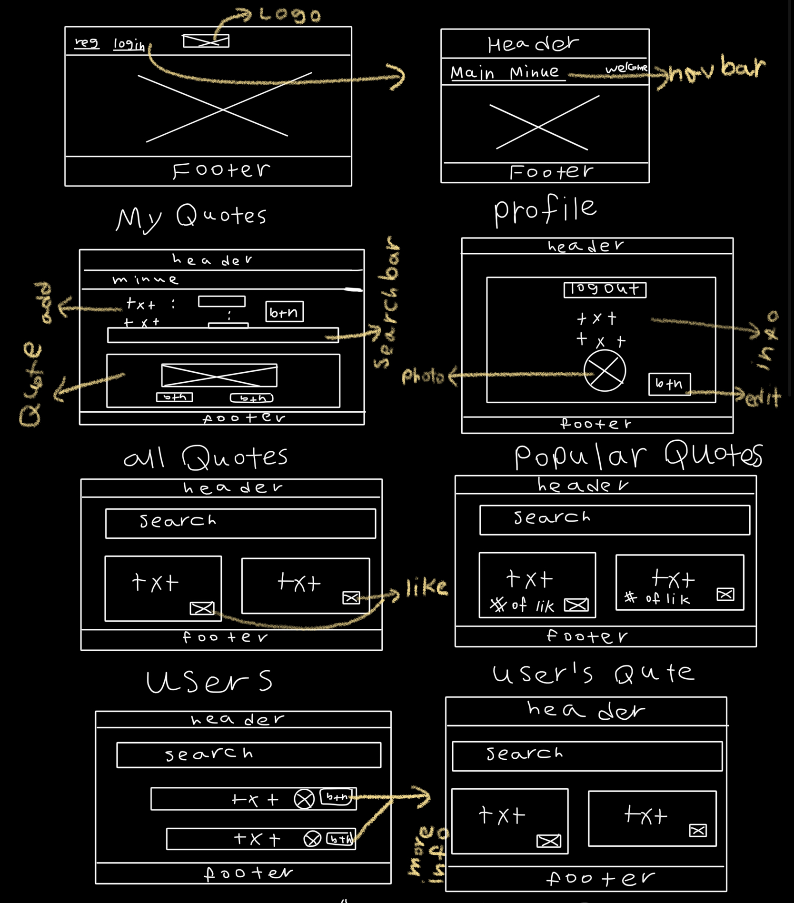
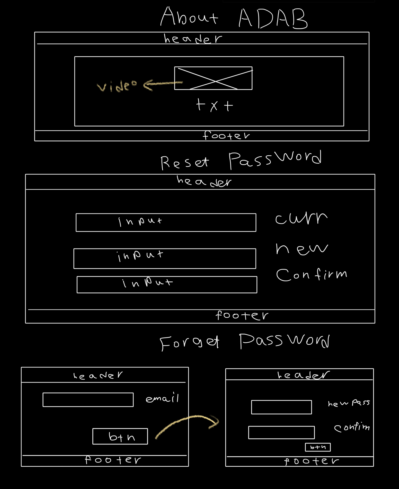

## **ADAB** Application: 
**ADAB** is a web application that allows the user to **sign up** and **log in** to the website to perform the **CRUD** functionalities which are **adding**, **editing**, **deleting**, and **viewing** the details of **Quotes**. User can **like quotes**, view the **most liked** quotes of **ADAB** website. User can **reset the password** when forget the password. The app uses **JWT** for **authentication** and **authorization**. 
### **Back End** repository:
The Git repository of ADAB's BackEnd: [here](https://git.generalassemb.ly/ghaidhusall/ADABbackend).
### **Deployed** sites:
* **Front end**: 
[here](https://pages.git.generalassemb.ly/ghaidhusall/ADABfrontend/).
* **Back end**: 
[here](http://adab-env.eba-nafjbdmq.us-east-2.elasticbeanstalk.com).
### **Technologies** used: 
**ADAB** used a number of technologies:
* **Git Bash**
* **React**
* **APIs**
* **Cascading Style Sheets** and **Bootstrap**
* **JavaScript** and **HTML**
* **GitHub**, group project
* **GitHub Pages**, to deploy the web application.
### **Planning** documentation:
The planning documentation for **two weeks** to build **ADAB** website [here](Planing.jpg).
### **Wireframes**:
 
 
 ### **User stories**:
* As a user, I want to be able to create an account, so that I can login.
 * As a user, I want to be able to login, so that I can access the website's functionalities. 
* As a user, I want to manage my profile so that I can view and update my account details.
* As a user, I want to be able of adding new quote, so that can share my favorite quotes. 
* As a user, I want the ability to reset my password, so that I can get back into the site if I forget my password. 
* As a user, I want to be able to add Like to quotes, so that I can share my opinion. 
* As a user, I want to be able to delete my quotes, so I can manage what I shared. 
* As a user, I want to upload a profile picture, so that the users who are logged in can see it on my profile page.
* As a user, I want to view quotes of higher number of likes, so that I can see the most famous quotes.
* As an admin, I want to manage user accounts, so that I can delete any account.
### Embedded screenshot of the app:
* Registration: 
[HERE](reg.png).
* Login: 
[HERE](log.png).
* Navigation bar: 
[HERE](nav.png).
* User's profile: 
[HERE](profile.png).
* All Quotes: 
[HERE](allquotes.png).
* Add quote: 
[HERE](addnewquote.png).
* Edit quote: 
[HERE](editquote.png).
* Popular quotes: 
[HERE](famousquotes.png).
* Website's users: 
[HERE](users.png).
* User's details: 
[HERE](userdetail.png).
* User's quotes: 
[HERE](userquotes.png).
* About the website: 
[HERE](aboutus.png).
### **Installation** Instructions:
This project was created with:
```
create-react-app
```
Once you have the app cloned, you should run:
```
npm install
```
You can then run it with:
```
 npm start
```
### **Future work** and **unsolved problems**:
The user of **ADAB** will be able to follow friends and be a part of the community of adab lovers to share ,rate quotes and poems.
### Resources
*  **https://www.codejava.net/frameworks/spring-boot/spring-security-forgot-password-tutorial**
*  **https://create-react-app.dev/docs/adding-custom-environment-variables**
*  **https://jwt.io/**
*  **https://material-ui.com/components/text-fields/**
*  **https://levelup.gitconnected.com/building-a-simple-dynamic-search-bar-in-react-js-f1659d64dfae?gi=216690603c1d**
